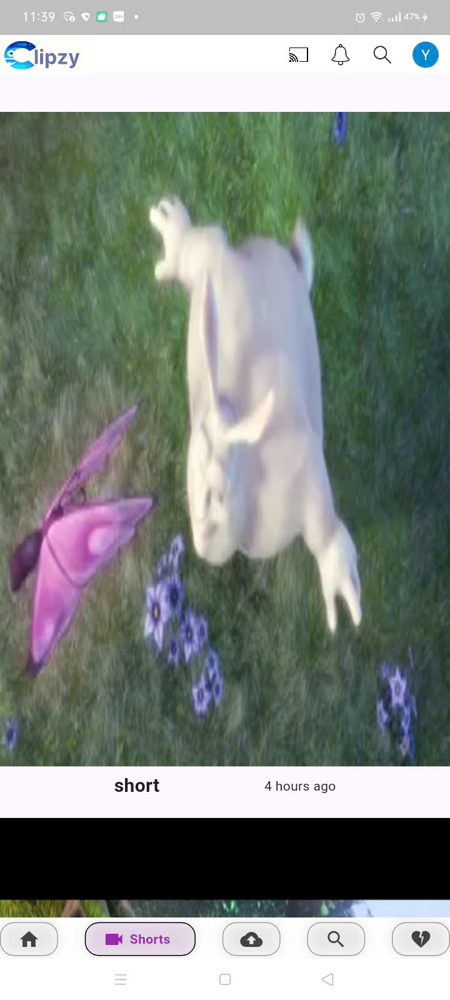

# 📱 Clipzy - Ứng dụng xem Video 

**Clipzy** là một ứng dụng Flutter cho phép người dùng xem và đăng tải video. Ứng dụng sử dụng Firebase làm backend và hỗ trợ các tính năng cơ bản như đăng video, xem video, và thêm caption.

## 🚀 Tính năng chính

- 🎥 Xem video ngắn (Shorts) và video dài (Long video)
- 📝 Đăng tải video 
- ⏱ Hiển thị ngày đăng
- ✅ Tích hợp Firebase Firestore
- 🔍 Tìm kiếm video và người dùng
- 🔐 Đăng nhập, đăng xuất, tạo username

## 🧰 Công nghệ sử dụng

- ✅ Flutter 
- ✅ Riverpod (quản lý trạng thái)
- ✅ Firebase (Firestore, Authentication)
- ✅ Dart

## 📂 Cấu trúc thư mục

```plaintext
lib/
├── main.dart
├── home_page.dart
├── pages_list.dart
├── cores/
│   ├── colors.dart
│   ├── methods.dart
│   ├── screens/
│   │   ├── error_page.dart
│   │   └── loader.dart
│   └── widgets/
│       ├── custom_appbar.dart
│       ├── custom_button.dart
│       ├── flat_buttonr.dart
│       ├── image_button.dart
│       └── image_item.dart
│── features/
│       ├── account/
│       │   ├── account_page.dart
│       │   └── items.dart
│       ├── auth/
│       │   ├── model/
│       │   │   └── user_model.dart
│       │   ├── pages/
│       │   │   ├── login_page.dart
│       │   │   ├── logout_page.dart
│       │   │   └── username_page.dart
│       │   ├── provider/
│       │   │   └── user_provider.dart
│       │   └── repository/
│       │       ├── auth_service.dart
│       │       └── user_data_service.dart
├── channel/
│   ├── my_channel/
│   │   ├── pages/
│   │   │   ├── channel_setting.dart
│   │   │   ├── home_channel_page.dart
│   │   │   └── my_channel_screen.dart
│   │   ├── parts/
│   │   │   ├── buttons.dart
│   │   │   ├── tab_par_view.dart
│   │   │   ├── tab_bar.dart
│   │   │   └── top_header.dart
│   │   ├── repository/
│   │   │   └── edit_field.dart
│   │   └── widgets/
│   │       ├── edit_setting_dialog.dart
│   │       └── setting_field_item.dart
│   ├── users_channel/
│   │   ├── pages/
│   │   │   └── user_channel_page.dart
│   │   ├── provider/
│   │   │   └── channel_provider.dart
│   │   └── subscribe_repository.dart
├── content/
│   ├── comment/
│   │   ├── comment_provider.dart
│   │   ├── comment_tile.dart
│   │   └── commnet_sheet.dart
│   ├── Long_video/
│   │   ├── parts/
│   │   │   ├── post.dart
│   │   │   └── video.dart
│   │   ├── widgets/
│   │   │   ├── long_video_screen.dart
│   │   │   ├── video_externel_button.dart
│   │   │   └── video_first_comment.dart
│   │   └── long_video_screen.dart
│   ├── short_video/
│   │   ├── pages/
│   │   │   └── short_video_page.dart
│   │   └── widgets/
│   │       └── short_video_tile.dart
│   └── bottom_navigation.dart
├── search/
│   ├── pages/
│   │   └── search_screen.dart
│   ├── providers/
│   │   └── search_providers.dart
│   └── widgets/
│       └── search_channel_tile_widget.dart
├── upload/
│   ├── comments/
│   │   ├── comment_models.dart
│   │   └── comment_repository.dart
│   ├── long_video/
│   │   ├── video_details_page.dart
│   │   ├── video_model.dart
│   │   └── video_repository.dart
│   ├── short_video/
│   │   ├── model/
│   │   │   └── short_video_model.dart
│   │   ├── pages/
│   │   │   ├── short_video_details_page.dart
│   │   │   └── short_video_screen.dart
│   │   ├── repository/
│   │   │   └── short_video_repository.dart
│   │   └── widgets/
│   │       └── trim_slinder.dart
│   └── upload_bottom_sheet.dart


## 🚀 Bắt đầu với dự án (Getting Started)
### 1. Yêu cầu hệ thống
- Hệ điều hành: Windows, macOS hoặc Linux.
- Công cụ phát triển: Flutter SDK, Android Studio hoặc Visual Studio Code.
- Firebase Console và Firebase CLI (nếu cần).

### 2. Cài đặt Flutter SDK
- Tải từ [flutter.dev](https://flutter.dev)
- Thêm vào biến môi trường `PATH`.
- Kiểm tra cài đặt: `flutter doctor`.

### 3. Cài đặt môi trường phát triển
Android Studio: Tải và cài đặt Android Studio để phát triển ứng dụng Android.
Visual Studio Code: Cài đặt nếu bạn muốn sử dụng VS Code thay vì Android Studio.
Cài đặt plugin Flutter & Dart: Trong Android Studio hoặc Visual Studio Code, cài đặt plugin Flutter và Dart.

### 4. Tích hợp Firebase
Bước 1: Truy cập Firebase Console, tạo một dự án mới.
Bước 2: Thêm ứng dụng Android/iOS vào dự án Firebase.
Bước 3: Lấy các thông tin cấu hình Firebase.
Bước 4: Cài đặt các package Firebase trong Flutter, thêm các dependencies vào file pubspec.yaml.

### 5. Cài đặt các gói phụ thuộc:
Mở terminal trong thư mục dự án và chạy lệnh sau để cài đặt các package trong file pubspec.yaml:
flutter pub get

### 6. Cấu hình ứng dụng:
Cập nhật các file cấu hình Firebase vào dự án Flutter (ví dụ: google-services.json cho Android hoặc GoogleService-Info.plist cho iOS).
Cập nhật quyền truy cập (như yêu cầu quyền lưu trữ, camera, v.v...) trong các file cấu hình Android hoặc iOS.

### 7. Chạy ứng dụng:
Bước 1: Mở terminal và di chuyển vào thư mục chứa dự án Flutter.
Bước 2: Chạy ứng dụng bằng lệnh:
flutter run
Hoặc sử dụng Android Studio/VS Code để chạy ứng dụng trên trình giả lập hoặc thiết bị thật.
8. Kiểm tra ứng dụng:
Đảm bảo ứng dụng hoạt động đúng, kiểm tra các tính năng chính như đăng nhập, xem video, tải lên video, v.v...

## 📸 Demo

### Giao diện chính


### Giao diện shorts



 👥 Thành viên dự án
Tên	                      Vai trò	                GitHub
--------------------------------------------------------------------
Ngô Gia Khánh	      Flutter Developer	   https://github.com/YenDi05
Huỳnh Ngô Yến Di	  Firebase & Backend   https://github.com/JinJin1503